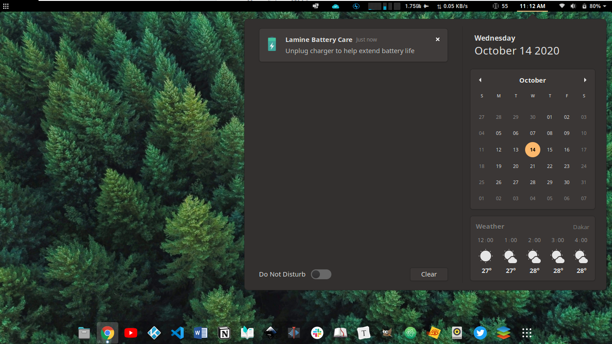

# Battery Monitor for Linux
Simple program to help keep laptop battery charge between 20 and 80 percentage.
* install dependencies:
  - sudo apt-get install python-gobject
  - sudo apt-get install libnotify-bin
  - You can also run _pip install notify2_ instead
* script and icons need to be in the same folder
* Add it to the list of system startup application

